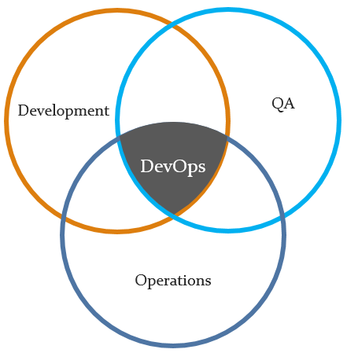

## What is DevOps

Devops can be define in many different way, However the fundamentals should be clear to understand what exactly devops is.

Different statment for devops you must have heard from various people.

- Devops is culture.
- Devops is CI/CD.
- Devops is mindset.
- Devops is process
- Devops is Cloud usage.
- Devops is Infrastructure as a code.
- Devops is agile.

> DevOps is a process which changes the way of people work together with the right mindset to embracce the culture to colloborate with each other, automating the continous delivery of software feautures, with the rigour and discipline of continous integration and a passion for continous testing, while using the power of standardised tooling to continously monitor everything being done from infrastrcute to actual production environment.

## How Devops is related to development and operation?

In tradition way of working in any organization, developers are responsingble for developing a feauture and submit it for release.
Then operation team is responsible to maintain the production environment, and they completly rely on developers quality of code. Since in case of buggy code or any issue related to production issue operation team has to wake up in middle of night and try to triage the issue without knowing the technical details.
In this way of working, there are more chances of blame game on teams.
In case of Devops, development and operation work together in collaboration and production environmnet becomes the responsiblity of both.

## Benefits of Devops

## Devops Responsibility

- **Plan:** Before building the infrastructure, spend some good time to understand the application and then align your goals to design your Infrastructure
- **Code:** Making infrastrcute as a code, Configuration as a code, security as a code, code review, source code management tools, code merging
- **Build:** Automating the build by bringing the continuous integration and using source control tools, build status
- **Test:** Include Unit testing, integration testing, continuous testing tools that provide feedback on business risks, determine performance
- **Package:** Create artifact of software and store in repository with version control to enable the rollback and continous deployment process.
- **Release:** change management, release approvals, release automation
- **Operate:** Automated the infrastrcute and keep it as a code, setting up the packages, infrastructure changes (scalability), infrastructure configuration and management, capacity planning, capacity & resource management, security check, service deployment, high availability (HA), data recovery, log/backup management, database management
- **Monitor:** Setting up a monitor tool to monitor the application performance, enable log monitoring, end user experience, incident management by using various tools like  pagerduty.

# DevOps Toolchain
There are various tools which can be learn and use to Implement the devops process within an organization.
- **Source Version Control**
> git, bitbucket, svn, codecommit
- **Continous Integeration**
> Jenkins, Travis, Circle, Bamboo
- **Infrastructure Provisioning**
> Terraform, Cloudformation, Chef, Puppet, Ansible
- **Configuration Management**
> Chef, Puppet, Ansible
- **Containerization and management**
> Docker, Kubernetes
- **Log monitoring**
> Graylog, ELK, Splunk, Graphite
- **Application monitoring**
> Newrelic, appdynamic, nagios, zabbix
- **Incident Management**
> Pagerduty, Sqaudcast, opsgenie

## DevOps Learning Roadmap
To become a Devops  or setting the DevOps process, you must have handson experience on atleast one tool from each section of above DevOps Toolchain.
Also follow the below path to get the knowledge on all aspects to become a DevOps.

- **Step 1:** Learn a basic programming language

    > Python, Ruby, Shell Script

- **Step 2:** Learn about source version control tool

    >[Git Learning](https://github.com/mattyait/devops_learning/blob/master/git/README.md)

- **Step 4:** Learn Package Manager

- **Step 5:** Learn about Unit Testing

- **Step 6:** Learn about databases (RDBMS & NoSQL)

- **Step 12:** Learn how to use Docker

- **Step 13:** Learn about kubernetes

    >[Kubernetes](https://github.com/mattyait/devops_learning/blob/master/kubernetes/README.md)

- **Step 14:** Knowledge of Web Servers

- **Step 15:** Learn different protocols

- **Step 16:** Configuration tool

    >[Configuration Tool](https://github.com/mattyait/devops_learning/blob/master/ConfigurationTool/README.md)

# Test changes in new branch
