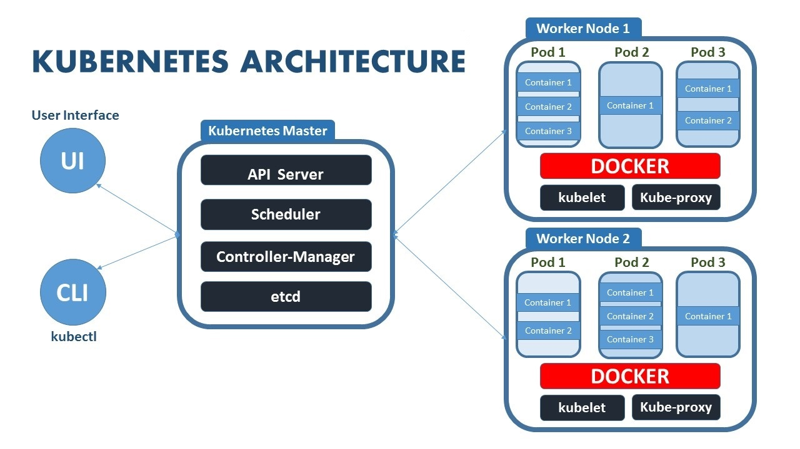

# Kubernetes
Kubernetes is an open source container orchestration engine for automating deployment, scaling, and management of containerized applications.

# Kubernetes Arch

## UI
You can use Dashboard to deploy containerized applications to a Kubernetes cluster, 
troubleshoot your containerized application, and manage the cluster resources. 
You can use Dashboard to get an overview of applications running on your cluster, as well as for creating or modifying individual Kubernetes resources

## Kubectl
kubectl controls the Kubernetes cluster manager. It's Cli for running commands to manage the cluster.

## Pods
Pods are the smallest deployable units of computing that can be created and managed in Kubernetes.

## kubelet
The kubelet is the primary “node agent” that runs on each node. The kubelet works in terms of a PodSpec. 
A PodSpec is a YAML or JSON object that describes a pod. 
The kubelet takes a set of PodSpecs that are provided through various mechanisms (primarily through the apiserver) and 
ensures that the containers described in those PodSpecs are running and healthy. 
The kubelet doesn’t manage containers which were not created by Kubernetes

## Kubernetes Master
The Kubernetes master is responsible for maintaining the desired state for your cluster. When you interact with Kubernetes, 
such as by using the kubectl command-line interface, you’re communicating with your cluster’s Kubernetes master.
The “master” refers to a collection of processes managing the cluster state. Those processes are: kube-apiserver, kube-controller-manager, kube-scheduler and etcd.
Typically these processes are all run on a single node in the cluster,
and this node is also referred to as the master. 
The master can also be replicated for availability and redundancy.

- kube-apiserver
- kube-controller-manager
- kube-scheduler
- etcd

## Kubernetes Nodes
The nodes in a cluster are the machines (VMs, physical servers, etc) that run your applications and cloud workflows. 
The Kubernetes master controls each node; you’ll rarely interact with nodes directly.
